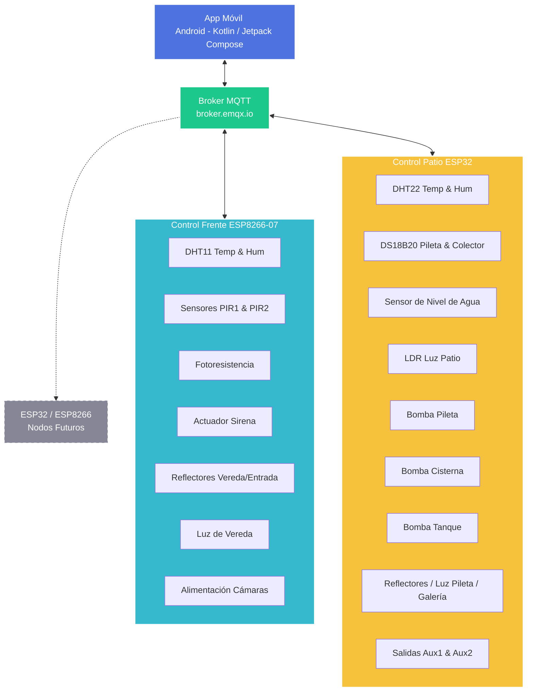

# Propuesta de Arquitectura y Diseño de la Aplicación Móvil
## Sistema Control Integrado - Nuestro Hogar (Alarma y Domótica)

Este documento detalla la estructura tentativa, diseño estético y mapeo de variables para la nueva aplicación móvil del sistema de domótica y seguridad del hogar. Está diseñada para ser **completa, intuitiva, escalable y con un estilo visual moderno**, adaptándose tanto a los firmwares actuales (Frente y Patio) como a futuros nodos de hardware.

---

## 1. Arquitectura de Integración y Escalabilidad

La comunicación de la aplicación móvil se realiza a través de un **Broker MQTT** (actualmente `broker.emqx.io`). La App se suscribe a los temas de estado publicados por los diferentes nodos del hogar y publica comandos en los temas correspondientes para actuar sobre el hardware.



### Principio de Escalabilidad (Futuro Hardware)
Para asegurar que se puedan agregar sensores y actuadores en el futuro sin rediseñar la App desde cero:
1. **Estructura Temática MQTT Jerárquica**: Los nuevos nodos utilizarán la estructura `NuestroHogar/[Nombre_Nodo]/Estado` para publicar telemetría en JSON y `NuestroHogar/[Nombre_Nodo]/Comando` para recibir configuraciones.
2. **Interfaz de Carga Dinámica / Modular**: La UI de la App se construirá sobre la base de tarjetas o módulos reutilizables. Si se detecta un nuevo nodo en la red MQTT, la App podrá autogenerar una sección básica o permitir activarla desde los ajustes.

---

## 2. Mapa de Navegación: Pestañas y Sectores

Se propone una interfaz con una **barra de navegación inferior (Bottom Navigation Bar)** moderna de 5 pestañas principales. Cada una de ellas agrupa un sector lógico del hogar.

### Pestaña 1: Inicio (Dashboard)
Es la pantalla de bienvenida y control rápido. Diseñada para dar información crítica de un vistazo y permitir acciones inmediatas.
*   **Estado de Conexión**: Indicador visual arriba (MQTT Conectado/Desconectado, retardo de ping).
*   **Botón de Pánico Sirena**: Botón rojo central vibrante con efecto de brillo ("Glow") y confirmación de doble toque para encender/apagar la sirena inmediatamente en caso de emergencia.
*   **Resumen Climatológico**: Tarjeta con la temperatura y humedad exterior promedio (Frente + Patio).
*   **Resumen Pileta**: Muestra rápida de la temperatura actual de la pileta y si el sistema solar está en funcionamiento.
*   **Alertas Activas**: Banner dinámico si hay alarmas de movimiento recientes, nivel de cisterna bajo, o si alguna bomba lleva funcionando más de lo normal.

### Pestaña 2: Climatización (Pileta)
Sector especializado en el control del climatizador solar de la pileta y las bombas.
*   **Dial de Control Termostato**: Control circular interactivo y táctil para setear `tempSet` (temperatura de consigna de la pileta).
*   **Monitoreo Térmico**:
    *   `tempPileta` (Temperatura actual del agua).
    *   `tempColector` (Temperatura en colectores solares del techo).
    *   `Diferencial de Temperatura` (`tempColector - tempPileta` con indicación visual de transferencia de calor).
*   **Modo de Bomba Pileta**: Selector de tres estados (Apagado / Encendido / Automático) utilizando controles deslizantes o botones segmentados de diseño premium.
*   **Interruptor de Intercambio Solar**: Switch de activación para la lógica automática diferencial (`IntercambioST`).
*   **Diagnóstico de Bomba**:
    *   Estado real de funcionamiento (`bombaPiletaST`).
    *   Tiempo actual de encendido continuo y tiempo acumulado en el día.
    *   Alertas de seguridad (si está bloqueada por `minOffTime` o apagada por `maxOnTime`).

### Pestaña 3: Iluminación y Servicios (Domótica)
Sector dedicado al control de luces, bombas de agua y relés auxiliares.
*   **Sección Luces**: Tarjetas dinámicas con micro-animaciones (cambio de tonalidad y gradiente cuando se encienden).
    *   *Frente*: Reflectores (Apagado/Encendido/Auto), Luz de Vereda (Apagado/Encendido/Auto).
    *   *Patio*: Reflectores Patio (Apagado/Encendido/Auto), Luces Pileta (Apagado/Encendido/Auto), Luz Galería (Apagado/Encendido/Auto), Luz Galería Borde (Apagado/Encendido/Auto).
*   **Sección Agua (Pumps)**:
    *   **Nivel de Cisterna**: Gráfico de barra vertical con degradado azul que muestra si el sensor capacitivo detecta agua (`nivelAguaST`).
    *   **Bomba Cisterna**: Control segmentado (Apagado / Encendido / Auto).
    *   **Bomba Tanque**: Control segmentado (Apagado / Encendido / Auto).
*   **Sección Auxiliares**:
    *   Interruptores rápidos para `Aux1` y `Aux2`. Permite personalizar el nombre desde la interfaz (ej. "Riego", "Cascada Pileta").

### Pestaña 4: Seguridad (Alarma)
Control completo de la seguridad perimetral de la casa.
*   **Armado de Alarma**: Estado de armado general de la casa (permite integrar lógica de armado ausente/presente en el futuro).
*   **Alimentación de Cámaras**: Interruptor directo para apagar o encender (resetear) las cámaras de seguridad (`CamarasEn`).
*   **Configuración de Sirena**: Modo de Sirena general (Apagada / Automática).
*   **Estado de Sensores**:
    *   Visualización de detección en tiempo real para `PIR1` y `PIR2`.
    *   Interruptor para deshabilitar individualmente cada sensor (`PIR1En`, `PIR2En`) si alguno empieza a fallar o dar falsos positivos.
*   **Historial de Eventos (Log de Movimientos)**:
    *   Registro temporal de detecciones de movimiento.
    *   Filtro por día (con selector de fecha nativo en calendario) para auditoría de movimientos históricos.

### Pestaña 5: Configuración Avanzada (Variables)
Sector protegido para calibrar el comportamiento de los algoritmos de las placas ESP.
*   **Parámetros de Pileta**:
    *   Entradas numéricas para delta de encendido (`tempDif_on`) y delta de apagado (`tempDif_off`).
    *   Ajuste de tiempos de protección de bomba en minutos (`minOnTime`, `minOffTime`, `maxOnTime`).
*   **Ajustes de Luz y Noche**:
    *   Ajuste del umbral `ValorNoche` del conversor analógico-digital (ADC) para clasificar cuándo es de noche.
    *   Ajuste de histéresis (`histeresisLuz`).
*   **Configuración del Sistema**:
    *   Intervalo de telemetría en segundos (`intervalData`).
    *   Parámetros del Broker MQTT (Host, Port, User, Pass).
    *   **Diagnóstico de Hardware**: Mapeo de WiFi (señal RSSI en dBm de Frente y Patio), direcciones IP asignadas, tiempo de actividad (uptime) y opción de iniciar actualización de firmware OTA de forma inalámbrica.

---

## 3. Guía de Diseño Estético y Experiencia de Usuario (UX/UI)

Para lograr una interfaz premium, intuitiva y moderna (diseño "WOW"), se propone seguir las siguientes pautas visuales:

1.  **Gama de Colores e Identidad Visual**:
    *   **Tema Oscuro por Defecto**: Fondo en gris muy oscuro (`#121214` o `#0F0F12`) con tarjetas en gris grafito (`#1E1E24`) y bordes muy sutiles (`#2D2D35`). Esto ahorra batería (pantallas OLED/AMOLED) y da un aspecto tecnológico de alta gama.
    *   **Acentos de Color por Categoría**:
        *   *Domótica/Climatización*: Azul eléctrico (`#00D4FF` o `#007BFF`) y turquesa.
        *   *Iluminación*: Amarillo cálido / Ámbar (`#FFB300` o `#FF8F00`) simulando la calidez de los filamentos.
        *   *Seguridad*: Rojo vivo (`#FF3B30`) y Naranja (`#FF9500`).
        *   *Estado OK*: Verde esmeralda (`#34C759`).
2.  **Morfología (Glassmorphism)**:
    *   Uso de tarjetas translúcidas con desenfoque de fondo ("background blur") y bordes degradados muy finos que simulan vidrio sobre un fondo con sutiles orbes de color desenfocados.
    *   Esquinas redondeadas suaves (entre 12dp y 16dp) para una estética moderna y amigable.
3.  **Controles de Interacción e Iconografía**:
    *   Uso de iconos vectoriales limpios y de trazo fino (estilo Outlined de Material Design 3).
    *   Diales táctiles circulares y fluidos para variables analógicas (temperatura setpoint).
    *   Feedback háptico (vibración suave) al interactuar con interruptores y botones clave (como el botón de pánico).

---

## 4. Estructura de Datos y Comunicación MQTT

A continuación, se detalla la matriz de comunicación de la aplicación con los dos sistemas de hardware actuales:

### Canalización de Mensajería: Control Frente (ESP8266)

| Variable / Control | Dirección | Tema (Topic) MQTT | Formato de Payload / Valores |
| :--- | :--- | :--- | :--- |
| **Temperatura Frente** | Recibe de ESP | `Ambiente/Temp` | Texto: `"Temperatura: [Valor] "` (ej. `"Temperatura: 25 "`) |
| **Humedad Frente** | Recibe de ESP | `Ambiente/Hum` | Texto: `"Humedad: [Valor] "` (ej. `"Humedad: 60 "`) |
| **Luz Frente** | Recibe de ESP | `Ambiente/Luz` | Texto: `"Es de [día/noche]: [Valor]"` |
| **Sensor PIR 1** | Recibe de ESP | `Movimiento/PIR1` | Texto: `"Movimiento Detectado!!!"` |
| **Sensor PIR 2** | Recibe de ESP | `Movimiento/PIR2` | Texto: `"Movimiento Detectado!!!"` |
| **Contador de Movimientos**| Recibe de ESP | `Movimiento/PIRc` | Texto: `"Cant. de movimientos detectados: [Valor] "` |
| **Reflectores Frente** | Envía a ESP | `Iluminacion/Reflectores`| Entero: `0` (Apagado), `1` (Encendido) *(Se propone expandir a `2` Auto)* |
| **Luz Vereda** | Envía a ESP | `Iluminacion/Vereda` | Entero: `0` (Apagado), `1` (Encendido) *(Se propone expandir a `2` Auto)* |
| **Sirena** | Envía a ESP | `Alarma/Sirena` | Entero: `0` (Apagado), `1` (Encendido) |
| **Cámaras** | Envía a ESP | `Alarma/Camaras` | Entero: `0` (Apagado), `1` (Encendido) |

### Canalización de Mensajería: Control Patio (ESP32)

El ESP32 del patio utiliza un formato JSON estructurado, lo que optimiza el tráfico de datos y simplifica la expansión de variables.

*   **Tema de Publicación (Telemetría)**: `BALH142N1788/Patio`
*   **Tema de Suscripción (Comandos)**: `BALH142N1788/Aveni793`

#### Estructura del JSON de Telemetría (Publicado por ESP32):
```json
{
  "tempPileta": 24.5,
  "tempColector": 28.2,
  "bombaPiletaST": false,
  "bombaPiletaConf": 2,
  "tempSet": 30.0,
  "tempDif_on": 5.0,
  "tempDif_off": 2.0,
  "minOnTime": 60000,
  "minOffTime": 300000,
  "maxOnTime": 900000,
  "bombaCisternaST": false,
  "bombaCisternaConf": 2,
  "bombaTanqueST": false,
  "bombaTanqueConf": 2,
  "reflectoresST": false,
  "reflectoresConf": 2,
  "luzPiletaST": false,
  "luzPiletaConf": 2,
  "luzGaleriaST": false,
  "luzGaleriaConf": 2,
  "luzGaleriaBordeST": false,
  "luzGaleriaBordeConf": 2,
  "luzAmbiente": 450,
  "nivelAgua": true,
  "tempTecho": 22.1,
  "humTecho": 55.0,
  "IntercambioST": true,
  "tempPiletaCrudo": 24.53,
  "tempColectorCrudo": 28.18
}
```

#### Estructura del JSON de Comandos (Enviado por la App):
La aplicación puede enviar un JSON parcial conteniendo únicamente las llaves que desea modificar.
```json
{
  "tempSet": 29.5,
  "bombaPiletaConf": 2,
  "reflectoresConf": 1,
  "luzPiletaConf": 0
}
```

---

## 5. Planificación del Desarrollo de la App

Para la construcción de la App se utilizarán las tecnologías nativas que ya posees configuradas y listas para usar:
*   **IDE**: Visual Studio Code o Android Studio Koala (2024.1.1 Patch 1)
*   **Lenguaje**: Kotlin con Jetpack Compose para una UI reactiva y moderna.
*   **Librerías Clave**:
    *   `org.eclipse.paho:org.eclipse.paho.client.mqttv3` o biblioteca Kotlin-friendly para la gestión de conexión MQTT en segundo plano con persistencia.
    *   `kotlinx.serialization` o `Gson` para serialización/deserialización ágil de payloads JSON.
    *   `Room` (Base de datos SQLite local) para almacenar el historial de alarmas y logs de movimiento sin depender siempre del broker.
    *   `Retrofit` o llamadas de red básicas (si a futuro se añade una API Rest).

El proyecto se ubicará en la nueva carpeta `Control integrado - App` dentro de la estructura raíz para mantener el orden de tus repositorios.
